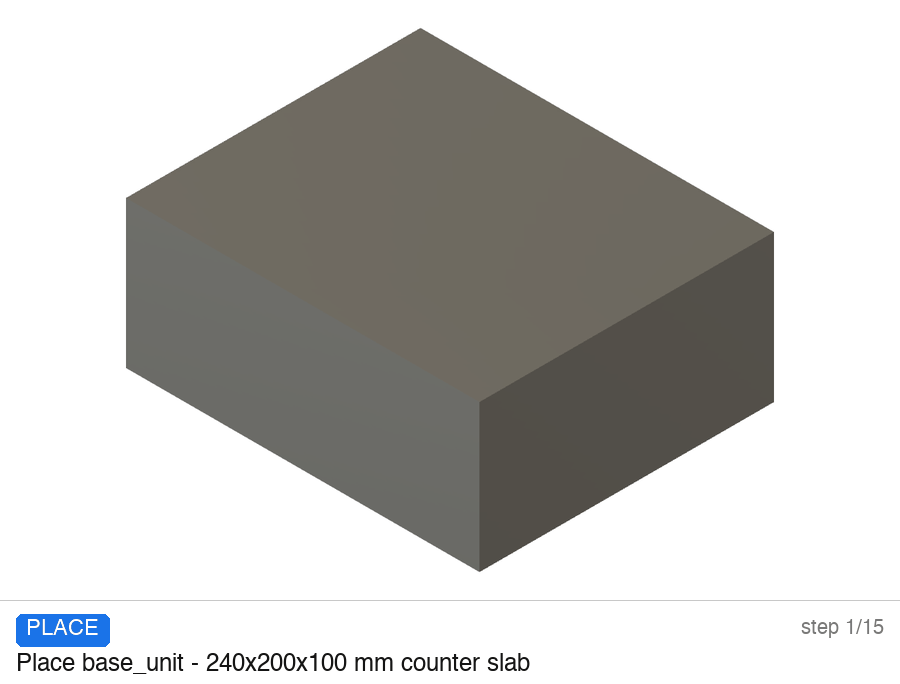
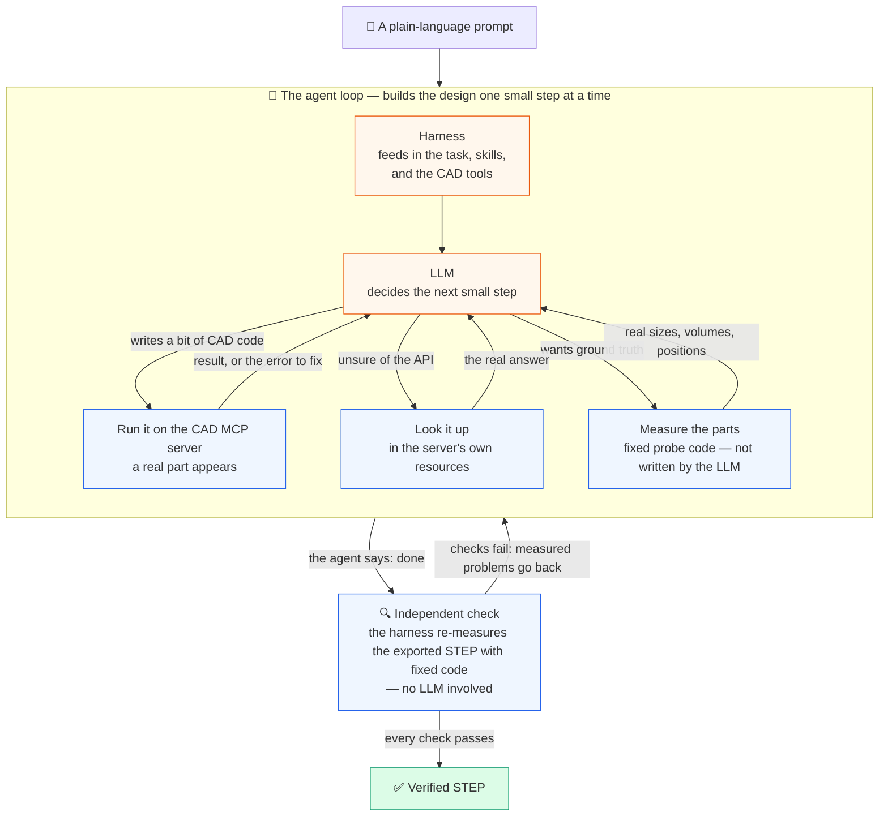
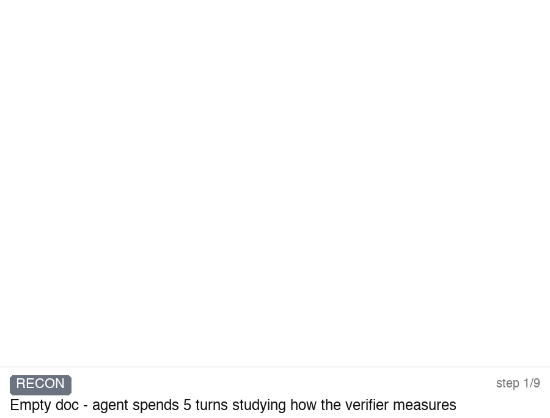
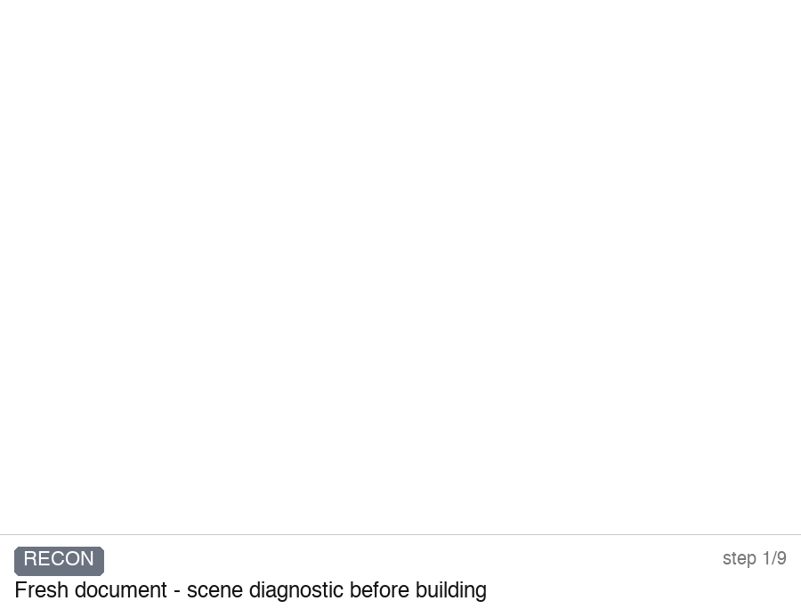
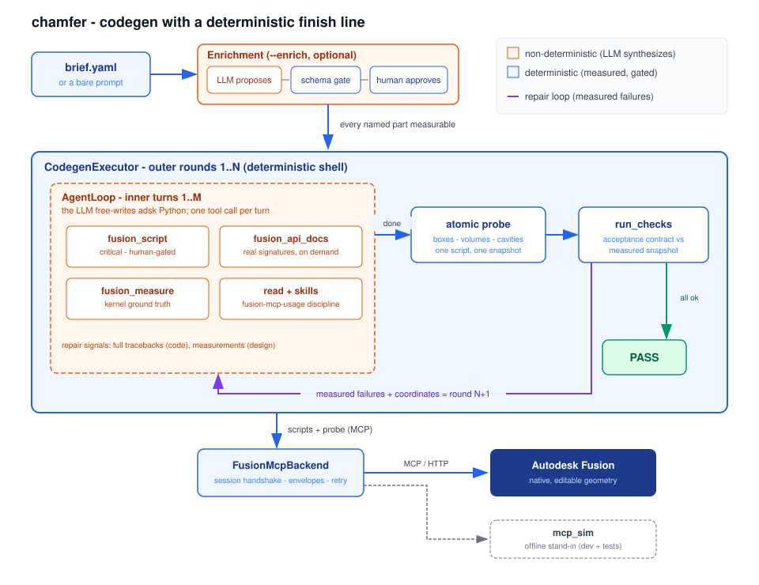

# chamfer

**Type what you want. Get a real, verified CAD part.**

Describe a product in plain words — a kettle, a desk lamp, a bracket — and an AI agent designs it as real, editable, correctly-sized geometry. It builds the part step by step through a CAD engine, measures its own work, fixes its own mistakes, and only claims success when a deterministic kernel check proves every requirement is met.

`chamfer` is a small, plain-Python **agent harness**, not a framework and not a chat wrapper. The harness itself is CAD-agnostic: the LLM drives an **external CAD MCP server** (build123d by default) to synthesize geometry, and a fixed verifier — never the model's own word — decides PASS. The whole loop reads top to bottom.



*One real run, replayed frame by frame: the agent places every component, **measures its own geometry, catches interpenetrating parts, and rebuilds them** before the independent verifier passes it. (This GIF is from an earlier Autodesk-Fusion-backed version; the current harness targets an external build123d MCP server — same loop, same measured finish line.)*

## How it works



1. **You ask in plain words.** A prompt describing the part you want.
2. **It designs in small steps.** The agent loop: write a small piece of CAD code, run it on the CAD MCP server, look at what happened, continue. Unsure of an API? It reads the server's own resources instead of guessing. A step fails? It reads the error and fixes it.
3. **It measures its own work.** After building, it asks the CAD kernel for the real numbers — sizes, volumes, positions — and repairs what's off: parts crossing each other, floating parts, a cavity that came out too small.
4. **The harness has the final word.** When the agent says "done", the harness independently re-measures the exported STEP and grades it with fixed code. Anything failing goes back to the agent, with the measured numbers, for another bounded round. Success is only reported when every check passes.

## Install

```bash
uv tool install chamfer-cad      # or: pip install chamfer-cad  (the CLI command is `chamfer`)
```

On first run, chamfer provisions **`~/.chamfer/`** with a set of default skills and an MCP config (the build123d server), the same way other CLIs provision their config directory.

## Quickstart

```bash
# build a part from a prompt (set your provider's API key in the environment first)
export ANTHROPIC_API_KEY=...      # or OPENAI_API_KEY / OPEN_ROUTER_API
chamfer run "a 2 L electric kettle with a rounded rim" --provider anthropic

# deliver the verified STEP to a path of your choice (dirs are created)
chamfer run "a desk lamp" --provider openai -o out/lamp.step

# no API key? drive it from Claude Code / Codex CLIs instead
chamfer run "a mounting bracket" --provider claude-code
```

The full test suite runs offline — no key, no network:

```bash
uv run --group dev pytest -q
```

### Options

- `--provider {scripted,openrouter,openai,anthropic,codex-cli,claude-code}` — where the reasoning comes from. `openrouter`/`openai`/`anthropic` read their API key from the environment (`OPEN_ROUTER_API`/`OPENROUTER_API_KEY`, `OPENAI_API_KEY`, `ANTHROPIC_API_KEY`); `codex-cli`/`claude-code` shell out to those CLIs.
- `--model <id>` — model id for the chosen provider.
- `-o, --output <path>` — copy the final verified CAD artifact to this path (parent dirs created).
- `--out <dir>` — run root for workspaces/evidence (default `~/.chamfer/runs`).
- `--sandbox` / `--no-sandbox` — filesystem discipline for tool calls (disabled by default for now).
- `--max-turns <n>` — agent turn budget.

## Configuration & skills

chamfer layers configuration highest-precedence first:

| Scope | Instructions | Skills | MCP servers |
|---|---|---|---|
| **Project** (your working dir) | `CHAMFER.md` (searched up from the cwd) | `.chamfer/skills/*/SKILL.md` | `.mcp.json` or `.chamfer/mcp.*` |
| **User global** | — | `~/.chamfer/skills/*/SKILL.md` | `~/.chamfer/mcp.json` |

A project skill or MCP server overrides a same-named global one. The defaults in `~/.chamfer/` are seeded on first run and are yours to edit or extend. Skills are progressive-disclosure Markdown (`SKILL.md` with a name + description in front-matter); their names go into the prompt and the agent reads the body on demand.

### Project instructions — `CHAMFER.md`

Drop a `CHAMFER.md` in your project (chamfer searches up from the working directory) to add your own instructions to the agent's system prompt — conventions, house rules, units, whatever the model should always know for this project. It is optional and **not** shipped with chamfer; the base system instruction lives in code. Think of it as chamfer's equivalent of a project `AGENTS.md`/`CLAUDE.md`.

The system prompt is assembled in a fixed order:

```
chamfer system instruction (built-in)
  → built-in tools + MCP tools
  → MCP server instructions / resources
  → your CHAMFER.md
  → skills (names + descriptions only; bodies read on demand)
  → your prompt
```

Any MCP server you declare is bridged generically into the agent loop — its tools are discovered via `tools/list`, risk-classified, and registered alongside the harness's built-ins. build123d ships as the default; point chamfer at another CAD MCP server and the same loop drives it.

## Gallery

Each GIF below is a script-for-script replay of a real session log — actual geometry states, not illustrations. **These runs are from an earlier Autodesk-Fusion-backed version of the harness**; the current release drives an external build123d MCP server through the same measured loop.

### Electric kettle



A cylindrical body on a power base, a C-handle with measured hand clearance, a domed lid and a spout — with one live self-correction: the spout first extruded upside-down, the agent saw it in its own measurement and rebuilt it at the rim.

### Desk lamp



A weighted base, a slim stem, an overhanging arm and a hollow shade — with a kept-clear light zone verified at a measured 258 mm, and stability confirmed from the center of mass sitting inside the base edge.

## Under the hood

The one non-negotiable: **the finish line is kernel-measured, never self-reported.**

- **The LLM gets freedom where geometry is synthesized.** It free-writes small CAD scripts against the live document, looks up real API details on demand, and repairs from raw errors — the standard coding-agent loop, applied to CAD.
- **Determinism decides what is true.** After the agent declares done, a fixed tiered verifier re-reads the exported STEP (structural checks with an optional geometric tier) and the acceptance checks run against that snapshot. Failures — with measured numbers — become the next round's task.
- **Risk is gated.** Every tool carries a risk class behind a policy gate: reads run freely; writes and CAD execution are consequential; a human can be required before irreversible actions.
- **Everything is logged.** Full session JSONL (every prompt, reply, and tool call) under `~/.chamfer/`.

## Architecture



The load-bearing decision is **where determinism lives**: the LLM writes any CAD code it wants (freedom where geometry is synthesized), and deterministic code decides what is true (a kernel-backed verifier + acceptance checks, with measured failures driving bounded repair rounds).

The source is flat, plain Python you can read top to bottom — the agent loop, the tools, the generic MCP bridge, and the verifier — under `src/`, with no agent framework.

## What it is not

Not a product, not a chat assistant, and not affiliated with Autodesk. It is a reference harness for building *reliable* codegen agents on top of a CAD kernel: bounded loops, measured verification, risk-gated actions, every deterministic module unit-tested.

## License

Apache-2.0 — see [LICENSE](LICENSE).

*This is an independent open-source project — not affiliated with, endorsed by, or sponsored by Autodesk, Inc. Autodesk and Fusion are trademarks of Autodesk, Inc.*
