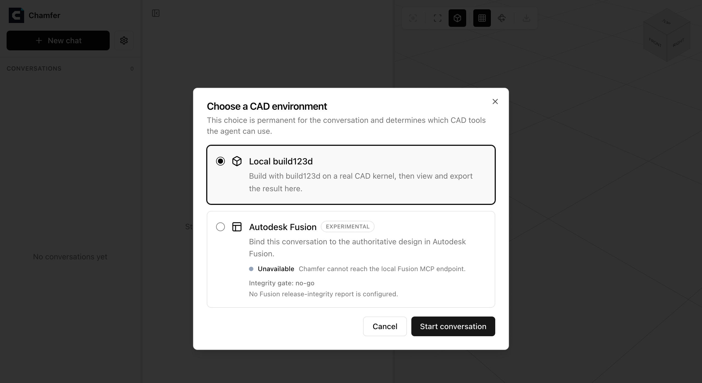

# Chamfer

**Describe it. Watch it take shape.**

[](https://chamferonline.com) [](https://www.npmjs.com/package/chamfer) [](https://github.com/SmartAI/Chamfer/actions/workflows/ci.yml) [](https://nodejs.org) [](LICENSE)

## What is Chamfer

Chamfer turns a sentence or a reference image into a real, parametric 3D model you can inspect and export.

It is an AI agent that writes [build123d](https://build123d.readthedocs.io/) Python, runs it on a real geometry kernel, and then measures what it built - dimensions, holes, body count - against what you asked for before showing it to you.
That check is the whole point: you get geometry that was verified, not a model that merely claims to be right.

## Demos

**Free to try at [chamferonline.com](https://chamferonline.com) - nothing to install.**
Sign in with Google and start designing in the browser; free design credits are included, and you can add your own Anthropic, OpenAI, or Google key whenever you want.

### Driving Autodesk Fusion autonomously

<a href="https://chamferonline.com/media/fusion-demo-0716.mp4"></a>

### Espresso machine from a product image

[](https://youtu.be/rvVmGJ5AsDQ)

### A Text/Image to 3D CAD AI Agent

[](https://youtu.be/QUC5HnAoHCI)

## Features

- **Two CAD backends, picked per conversation.** Model with local build123d, or bind the conversation to your live Autodesk Fusion session. Chamfer discovers the running Fusion instance and its MCP endpoint by itself - no port to configure - and shows the live connection state before you start.
- **Text and image prompts.** Attach a reference photo and Chamfer models against it.
- **Kernel-verified output.** Every part is measured and visually inspected with multi-view renders against the request before the agent calls it done.
- **Bring your own model.** Anthropic, OpenAI, or Google, configured in Settings or through `.env`.
- **Export from the viewer.** STL, OBJ, or GLB.
- **Local-first.** Run the CLI and your conversations, settings, and geometry stay on your machine.



Each conversation is bound to a backend when it is created.
The Fusion option reports what Chamfer just probed on your machine - above, no Fusion MCP endpoint is running, so the option is marked unavailable instead of failing later.

## How it compares to other coding agents

The same models that power Chamfer (Claude, GPT, Gemini) can already drive a CAD MCP server on their own, so we measured whether a purpose-built harness earns its place instead of asserting it.
Every arm got identical prompts and the identical build123d MCP server, and every exported STEP file was graded by a geometry-kernel oracle - never by the agent's own claim of success.

| Agent | Correctness | Tool calls / task | Context read / task | Output / task | Cost | Wall time |
|---|---|---|---|---|---|---|
| **Chamfer v0** | 129/129 | 6.3 | ~53k | 2,232 | **$1.79** | **722 s** |
| **Chamfer v1** (default) | 129/129 | 5.0 | ~48k | 3,087 | $2.16 | 807 s |
| Claude Code | 127/129 ¹ | 8.2 | ~433k | 9,849 | $10.50 | 2,283 s |
| Codex ² | 129/129 | 15.5 | ~1,169k | 4,617 | n/a | 1,754 s |

5 held-out parts, 3 runs each per agent.
Chamfer and Claude Code ran the same model (`claude-opus-4-8`); Codex ran `gpt-5.6-luna`.
Tool calls, context, and output are per-task means; cost and wall time are totals over the 15 runs.

Same parts built correctly, at **5.9x lower cost** and **3.2x lower wall time** than Claude Code, and no over-claims - Chamfer never reported a part as done while a check was failing.
The gap is the harness, not the model: a one-screen CAD prompt with six curated tools instead of 59 tool schemas of general-purpose scaffolding (~8x less context), one reconciliation pass over every requested dimension instead of repeated self-checks, and ~4x fewer output tokens, which is most of the wall-clock difference.

Full methodology, the artifact gallery, and every reproducible run summary: [benchmark report](benchmarks/REPORT.md).

¹ One slotted-plate run split cylindrical faces in the exported B-rep in a way the oracle does not re-merge; the geometry looks correct on inspection, so read this as "at least 127/129". That same run is the single over-claim.
² Codex ran through a proxy that does not report billing, so its cost is not comparable; its row supports the latency comparison only.

## Run it yourself

```bash
npx chamfer
```

Requires Node.js >= 22.19 and [uv](https://docs.astral.sh/uv/), which Chamfer uses to spawn the pinned `build123d-mcp` CAD server.
Open the printed URL, add your API key in Settings, and describe a part or click a preset prompt.
Conversations and settings live in `~/.chamfer`.
The Autodesk Fusion connector is local-only, so use the CLI for Fusion work.

### Configuration

Instead of typing keys into Settings, put them in a `.env` or `.env.local` file in the directory you run `chamfer` from.
[.env.example](.env.example) documents every supported variable (provider API keys, base URLs, default model, port, data dir).
Values found in the environment appear pre-filled in Settings with a `.env` badge; anything you change there overrides the environment and can be reverted with "Reset to .env".

## What gets sent where

Prompts and attached images go to the model provider you configure.
Fusion conversations additionally send selected normalized evidence from the bound design: necessary engineering snapshot fields, relevant installed API excerpts, selected views, and normalized action results.
Native geometry and Fusion files, unrelated documents and projects, credentials, and raw MCP traffic are never sent.
Running the CLI, CAD execution, conversations, and settings stay on your machine.

## Developing

```bash
npm install
npm run dev          # client on 5173, server on 8787
```

`npm run typecheck`, `npm test`, and `npm run build` cover every workspace.
The Playwright suite runs against a scripted fake LLM and a scratch database:

```bash
CHAMFER_FAKE_LLM=1 CHAMFER_DATA_DIR=$(mktemp -d) npm run e2e
```

Agent changes are gated by measurement rather than opinion: the golden case set, the geometry-kernel oracle, and the cross-agent runners in [`benchmarks/`](benchmarks/) decide whether a change ships.
Start with [benchmarks/README.md](benchmarks/README.md).

## License

Apache-2.0 ([LICENSE](LICENSE)).
[NOTICE](NOTICE) covers the bundled runtime components.
