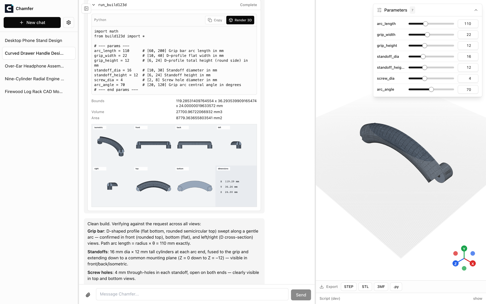
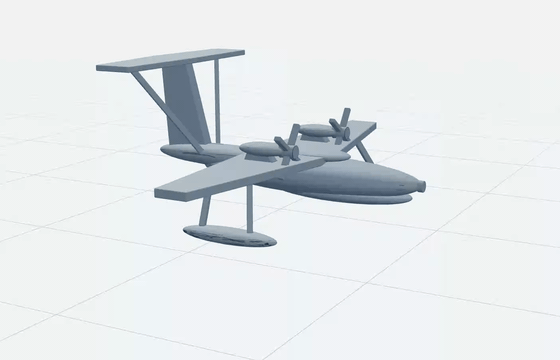

<p align="center">
  
</p>

<h3 align="center">Describe it. Watch it take shape.</h3>

<p align="center">
  <a href="https://smartai.github.io/Chamfer/"><b>Project page</b></a> ·
  <a href="https://youtu.be/rvVmGJ5AsDQ">Latest demo</a> ·
  <a href="https://youtu.be/QUC5HnAoHCI">Text-to-CAD demo</a> ·
  <a href="https://youtu.be/n72PvB1WUfw">Image-to-3D demo</a>
</p>

<p align="center">
  <a href="https://www.npmjs.com/package/chamfer"></a>
  <a href="LICENSE"></a>
</p>



## What is Chamfer

Chamfer is an AI CAD designer that turns text and reference images into verified, parametric 3D models.
For complex requests, it creates an evidence-backed plan, executes it over multiple steps, retrieves build123d guidance as needed, and checks both geometry and visual fidelity before finishing.
CAD executes locally in your browser; fine-tune dimensions with live sliders, then export STEP, STL, 3MF, or Python.
Prompts and attached images are sent to the model provider you configure.
CAD execution, geometry, conversations, and settings stay local.

**The finished part, live in the viewer:**



**Latest demo, building an espresso machine from a product image:**

[](https://youtu.be/rvVmGJ5AsDQ)

**Text to CAD:**

[](https://youtu.be/QUC5HnAoHCI)

**Image to 3D, from a single 2D picture:**

[](https://youtu.be/n72PvB1WUfw)

## Features

- Text and image prompts for reference-guided CAD
- Plan-first execution for long, multi-component builds
- Retrieval-backed build123d docs and progressive skill loading
- Context compaction for reliable long-running sessions
- Multi-view visual self-verification against reference images
- Browser-local build123d execution with kernel-enforced checks
- Live parametric sliders and STEP, STL, 3MF, or Python export

## How to use it

Requires Node.js >= 22.19.

```bash
npx chamfer
```

Open the printed URL, add your API key in Settings, and describe a part or click one of the preset prompts.
Your conversations and settings live in `~/.chamfer`.

### Configuration

Instead of typing keys into Settings, you can put them in a `.env` or `.env.local` file in the directory you run `chamfer` from.
See [.env.example](.env.example) for every supported variable (provider API keys, base URLs, default model, port, data dir) with explanations.
Values found in the environment appear pre-filled in Settings with a `.env` badge; anything you change there overrides the environment and can be reverted with "Reset to .env".

### Developing

```bash
npm install
npm run dev
```

## License

Apache-2.0 ([LICENSE](LICENSE)).
[NOTICE](NOTICE) covers the bundled runtime components.
