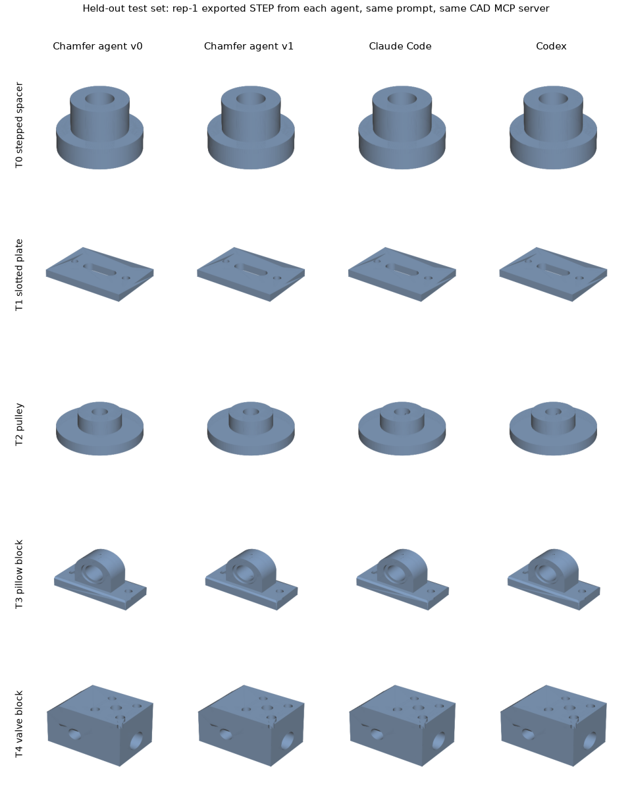

# Chamfer agent benchmark report - July 2026 milestone

**TL;DR: on a held-out set of mechanical CAD tasks, the Chamfer agent produced the same correct parts as Claude Code and Codex driving the same CAD server, at roughly 1/6 of Claude Code's cost and 1/3 of its wall-clock time, with zero over-claims.**

All numbers in this report come from committed run summaries under [`results/`](results/) and are reproducible with the runners in this directory.

## What was achieved

- A tiered, reference-validated golden benchmark for CAD agents, with a measurement-based oracle that grades exported STEP geometry instead of trusting any agent's self-report.
- A strict train/test split: a public dev set used for iteration, and a private held-out test set that was run exactly once, after the agent configuration was frozen.
- A four-arm head-to-head on that held-out set: two Chamfer agent versions, Claude Code, and Codex, all given the same prompts and the same CAD MCP server.
- The result: equal-or-better correctness at a fraction of the cost and latency of the generic agents.

## How agents are evaluated

Every arm receives the identical task prompt, which ends with a contract to export the finished part as STEP to an exact path.
The CAD backend for every arm is the same build123d MCP server, pinned to one version in the arm's MCP config, so all four agents spawn the identical server binary (Chamfer's Autodesk Fusion connector is a separate backend and is not part of this benchmark).
The server's split of responsibilities is worth stating plainly: the model writes all build123d Python, and the server deterministically executes it, returns errors with fix hints, and answers measurement queries; no arm gets a private verification channel.
The Chamfer agent exposes six curated tools from that server: `execute` (run build123d Python), `last_error`, `inspect_part`, `measure`, `render_view`, and `export`.
The generic agents connect to the same server through their own MCP clients and see its full surface; Claude Code's session listed all 36 server tools plus 23 of its own harness tools.
The exported STEP is then graded by [`oracle/oracle.py`](oracle/oracle.py), which imports the file with a real geometry kernel and checks name-independent geometric facts.
The oracle runs only after the agent has exited, an agent's own claim of success is never part of the grade, and a final message that claims completion while checks failed is counted as an over-claim.
An agent that fails to export scores zero.

Task tiers (dev set: 9 public cases in [`golden/v1/cases.json`](golden/v1/cases.json); test set: 5 held-out cases, one per tier):

| Tier | Complexity | Dev examples |
|---|---|---|
| T0 | single primitive | box |
| T1 | one feature family | drilled plate, L-bracket |
| T2 | interacting features | pocketed plate, flange |
| T3 | many interacting features | bearing housing, drill block |
| T4 | multi-axis + derived dimensions | gear plate, angled flange |

Check kinds the oracle grades per case:

| Check | What it measures |
|---|---|
| body-count | exactly one connected solid |
| dimensions | bounding box within tolerance |
| volume-band | material volume inside a validated band |
| cyl-group | hole/bore/boss groups: radius, count, axis, through-state, positions, entry face |
| inclined-planes | count and angle of non-axis-aligned faces |

Every expected value was validated against a reference build before the case was admitted.
A typical case carries 6 to 15 checks; here is the shape of one dev prompt:

> "Create the single-solid parametric industrial conveyor bearing support housing exactly as specified: a centered 180 x 110 x 16 mm base; a 24 mm thick, 110 mm wide upright with a semicircular R55 crown and bearing axis at X0/Z76; a 52 mm nominal through bearing seat; [...] export it as STEP to exactly this path: {EXPORT_PATH}"

Metrics captured per run:

| Metric | Definition |
|---|---|
| correctness | oracle checks passed / total (primary) |
| over-claim | final message claims completion while correctness < 100% |
| cost (USD) | provider-reported token cost |
| tokens | input, output, and cache traffic |
| tool calls | total invocations, executes separately |
| latency | wall-clock seconds, prompt to agent exit |

Anti-leakage protocol: the test set lives outside version control, was never read during prompt or agent iteration, and was executed exactly once after the configuration freeze, with N=3 repetitions per case per arm, sequentially, on the same machine.

## Headline result: held-out test set, four arms

5 unseen cases, 3 repetitions each, 43 oracle checks per repetition set (129 total per arm).
Chamfer arms and Claude Code ran the same model (claude-opus-4-8); Codex ran its own model (gpt-5.6-luna).

| Arm | Model | Correctness | Over-claims | Cost (USD) | Wall time |
|---|---|---|---|---|---|
| **Chamfer agent v0** | claude-opus-4-8 | **129/129** | **0** | **$1.79** | **722 s** |
| **Chamfer agent v1** | claude-opus-4-8 | **129/129** | **0** | $2.16 | 807 s |
| Claude Code | claude-opus-4-8 | 127/129 ¹ | 1 ¹ | $10.50 | 2,283 s |
| Codex | gpt-5.6-luna | 129/129 | 0 | n/a ² | 1,754 s |

That is 5.9x lower cost and 3.2x lower latency than Claude Code for the same or better deliverable, and 2.4x lower latency than Codex.

Per-case breakdown (checks summed over 3 reps; cost summed; wall time is per-run mean):

| Case | Chamfer v0 | Chamfer v1 | Claude Code | Codex |
|---|---|---|---|---|
| T0 stepped spacer | 18/18, $0.18, 25 s | 18/18, $0.23, 29 s | 18/18, $1.32, 55 s | 18/18, 82 s |
| T1 slotted plate | 21/21, $0.17, 26 s | 21/21, $0.21, 28 s | 19/21 ¹, $1.05, 50 s | 21/21, 80 s |
| T2 pulley | 21/21, $0.25, 37 s | 21/21, $0.31, 42 s | 21/21, $2.14, 163 s | 21/21, 108 s |
| T3 pillow block | 33/33, $0.51, 68 s | 33/33, $0.64, 76 s | 33/33, $2.66, 226 s | 33/33, 151 s |
| T4 valve block | 36/36, $0.68, 85 s | 36/36, $0.77, 95 s | 36/36, $3.33, 268 s | 36/36, 164 s |

¹ Claude Code's two dropped checks (and the resulting over-claim flag) are on one slotted-plate run whose geometry looks correct on manual inspection; the modeling technique it used splits cylindrical faces in the exported B-rep, which the current oracle does not yet re-merge. Read its correctness as "at least 127/129". The cost and latency gaps are unaffected.
² Codex ran through a proxy that does not report billing, so its cost is not comparable; it consumed ~9.5M input-side tokens across the 15 runs, about 22x the Chamfer agent's context traffic.

## The parts they built

Same prompt in, same part out - the difference is what it took to get there.
First-repetition exported STEP from every agent on every held-out case, rendered identically:

Individual renders are in [`report/assets/`](report/assets/), named `<case>.<arm>.png`.
The exported STEP files for all 60 runs are retained locally with the raw run transcripts.

## Why the Chamfer agent is cheaper and faster

The gap is not the model (Claude Code ran the identical model) and not the CAD server (identical binary for every arm).
It is the harness around the model: what the model must read every turn, and what the harness's instructions make it do.
Each factor below is measured from the 15 test runs per arm:

| Per-run mean | Chamfer v0 | Claude Code | Codex |
|---|---|---|---|
| agent turns | 6.5 | 9.2 | n/a |
| output tokens | 2,232 | 9,849 | 4,617 |
| context tokens read | ~53k | ~433k | ~1,169k |

1. **Purpose-scoped context.**
   The Chamfer agent carries a one-screen CAD system prompt and exactly six curated tool schemas.
   Claude Code's session carried 59 tool schemas (its 23 harness tools plus all 36 server tools) and its general-purpose scaffolding into every request; that is the 8x difference in context tokens read per run, and context is what you pay for.
2. **A verification contract instead of verification wandering.**
   The measurement tools are identical for every arm; the difference is the policy imposed on them.
   The Chamfer agent is instructed to verify with measured evidence in a single reconciliation pass: measure once, check every requested dimension, hole count, and diameter against the request, then stop.
   On the pulley case, Claude Code verified one simple part with `inspect_part`, `validate`, `find_holes`, and three `render_view` calls across 9 turns ($0.68, 163 s); the Chamfer agent verified the same part in 4 tool calls (37 s, ~$0.08), folding the hole check into the execute sandbox itself.
   Across the test set that discipline yields fewer turns (6.5 vs 9.2), zero over-claims, and no repeated self-checking loops.
3. **Terse output economy.**
   Output tokens are the expensive ones and dominate serial decode time.
   Claude Code emitted 4.4x the output tokens per run (plans, running commentary, summaries); that ratio shows up almost directly in the 3.2x wall-clock gap.

## Honest caveats

- All four arms are at or near the ceiling of this test set, so it proves parity on correctness plus a large efficiency gap; it no longer discriminates correctness at the top.
  The next test set needs harder tiers.
- Chamfer v1 (a stricter verification prompt) tied v0 on the test set at slightly higher cost.
  It ships as the product default for its honesty gains on the hardest dev tier (243/243 checks with zero over-claims, where v0 dropped a check and over-claimed once), but we claim no test-set superiority of v1 over v0.
- Codex ran a different model family, so its row supports the latency comparison only.
- N=3 on 5 held-out cases is enough to establish the efficiency gap (it is consistent across every case and repetition) but modest for fine correctness distinctions.

## Reproducing

Each arm has a runner under [`runners/`](runners/), and [`README.md`](README.md) documents the commands, credentials, and method rules.
Grading requires a Python environment with build123d; see the repository's `py-tests/` setup.
Committed summaries for every run referenced here are under [`results/`](results/).
